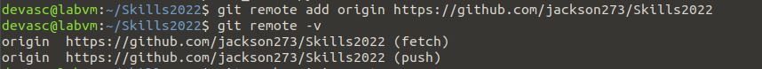

# Task 1: Github skills test

## Task name: 

Manage GitHub scripts and documents 

## Task description: 
Create a folder “Skills2022” in your DEVASC virtual machine and start a git 
repository.

## Task preparation
- DEVASC VM
- git installed on DEVASC VM
- github account

## Task implementation
1) Create Skills2022 directory on DEVASC VM
2) Create Skills2022 repository on github account
3) Init and Add remote repository

 `git init`
 
 `git branch -M main`
 
 `git remote add origin <repository's link>`

## Task troubleshooting
When running `git push origin main` i encouted problem:
"Remote: Support for password authentication was removed on August 13, 2021...
fatal: Authentication failed for..."
I fixed it by logged in github account in VS Code.

## Task verification

