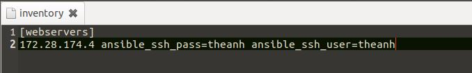
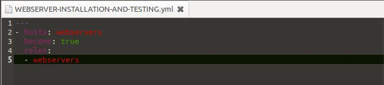
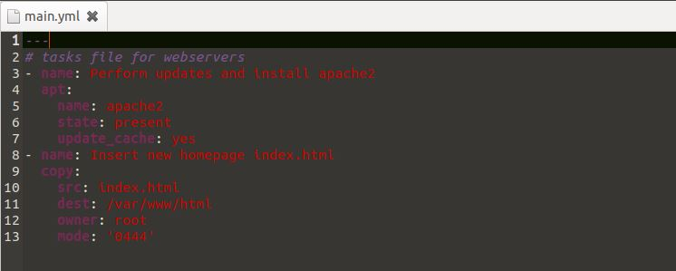
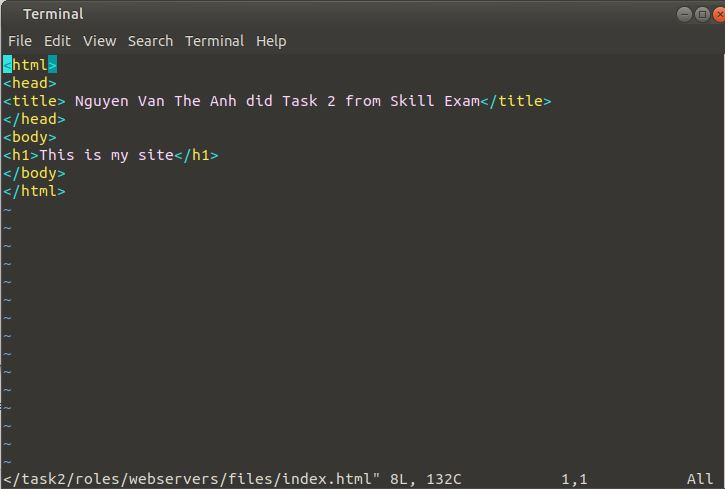
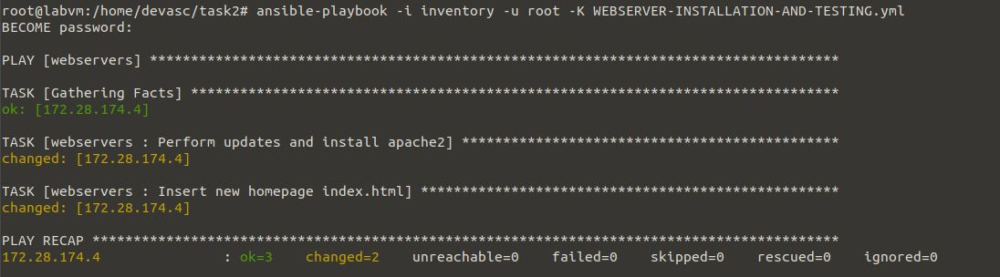
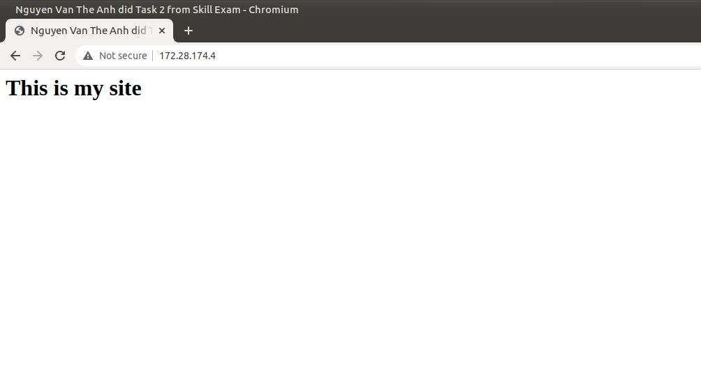

# Task 2: Ansible skills test

## Task name: 
Manage WebServers through Ansible.

## Task description: 
Write the Ansible script to install and test the websever with ping command 
in a single playbook. Choose either Apache or Nginx server based on your own 
preference.

## Task preparation
- DEVASC VM and another VM
- Two machines can ping to each other
- Ansible installed on host machine

## Task implementation
1) Create inventory file with credentials of the machine that I want to deploy

2) Create playbook file named WEBSERVER-INSTALLATION-AND-TESTING

3) Config the webservers role in main.yml

4) Create index.html for webservers

5) Run Ansible to install

## Task troubleshooting
I faced the problem "...can't connect to remote host via ssh.."
-> I fixed it by adding ansible_ssh_pass and ansible_ssh_user in inventory file

## Task verification

