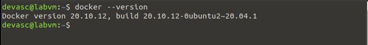
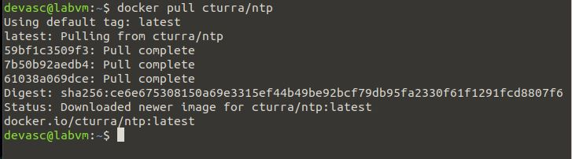
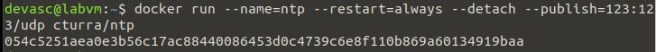
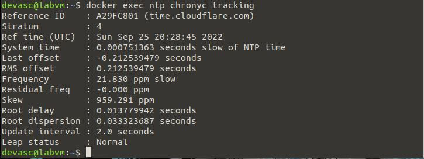
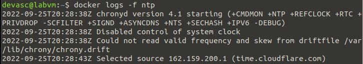

# Task 3: Docker

## Task name: 
Manage Docker microservices

## Task description: 
Create a docker microservice

## Task preparation
- DEVASC VM installed docker

## Task implementation
1. Check docker in local machine
 `docker --version`
   

2. Pull ntp image from docker hub
 `docker pull cturra/ntp`
  

3. Check the result:
 `docker images | grep ntp`
    

4. Run the docker container
 `docker run --name=ntp --restart=always --detach --publish=123:123/udp cturra/ntp`
  

5. Check the result
       
 
## Task troubleshooting
No error occured in this task

## Task verification
 
