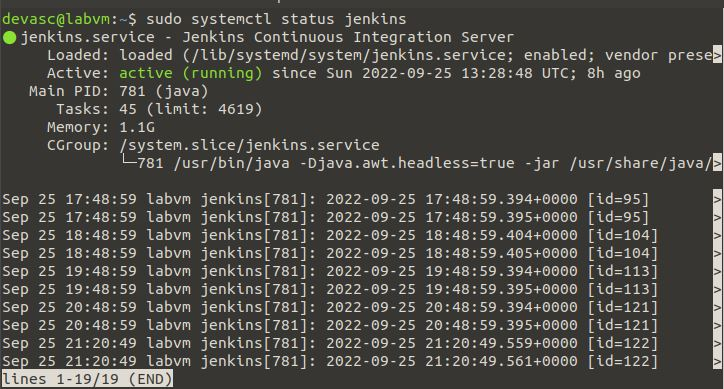
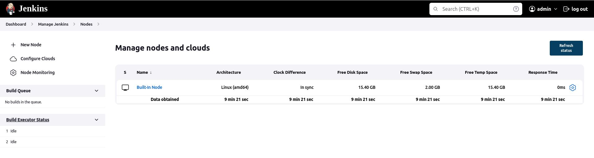
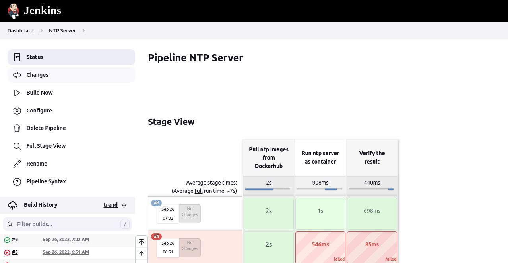
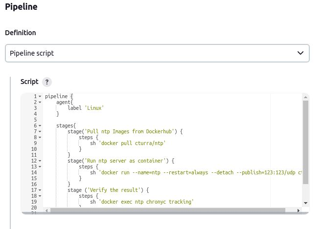
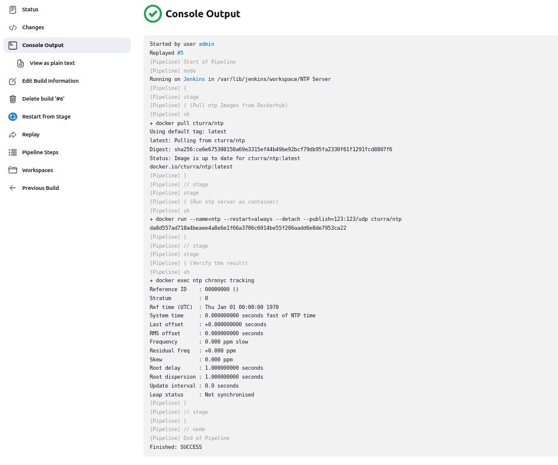
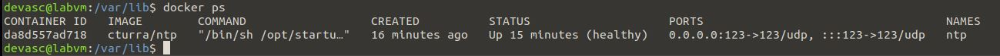

# Task 4: Jenkins

## Task name: 
CI/CD Pipeline using Jenkins

## Task description: 
Create a Jenkins pipeline

## Task preparation
- DEVASC VM installed docker and jenkins

## Task implementation
1. Check if jenkins is enable in local machine      
    
- Jenkins is available in localhost:8080, we need to take the password to access as admin with this command:     

2. Create Agent in Jenkins to perform the task (in this case I use my local VM)    

3. Create pipeline to do the task     
   

4. Create script for jenkinsfile to run the job    
 

5. Check the result     
         
 
## Task troubleshooting
Got "Permission denied when trying to connect to Docker daemon" when pulling ntp from docker, fixed this by the command `sudo usermod -aG docker jenkins`

## Task verification

