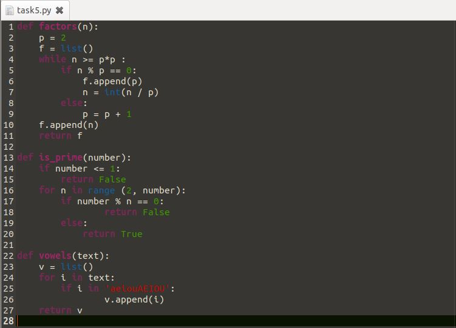
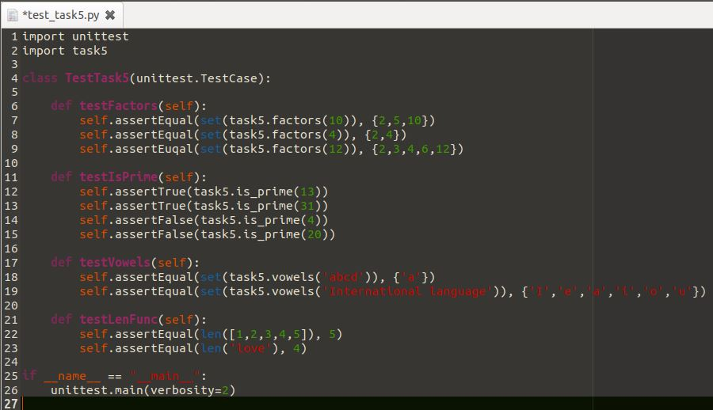
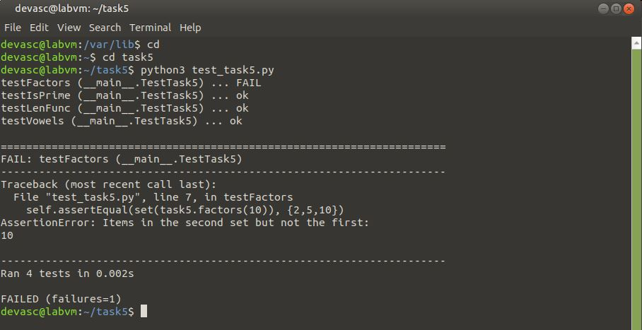

# Task 5: Unit Testing

## Task name: 
Unit testing

## Task description: 
Create a unittest script in Python that asserts the output of all the 
functions in the given Python module.

## Task preparation
- DEVASC VM can run python

## Task implementation
1. Create task5.py file with all functions needed to test
    

2. Create test_task5.py to perform the task    
 

3. Run unit test with command `pyhton3 test_task5.py`    
       
 
## Task troubleshooting
Function factors did not run correctly

## Task verification

